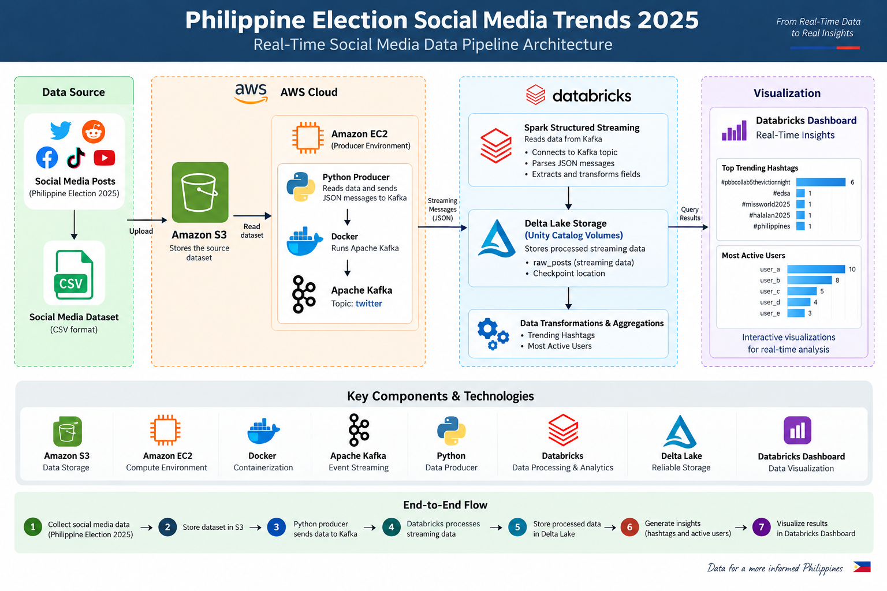
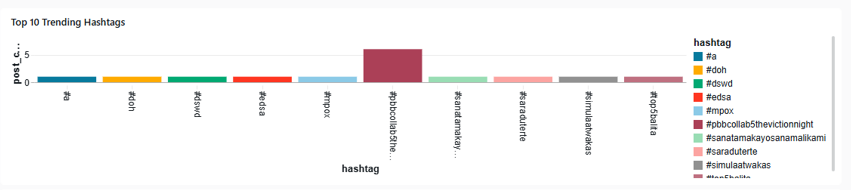
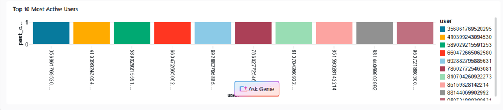
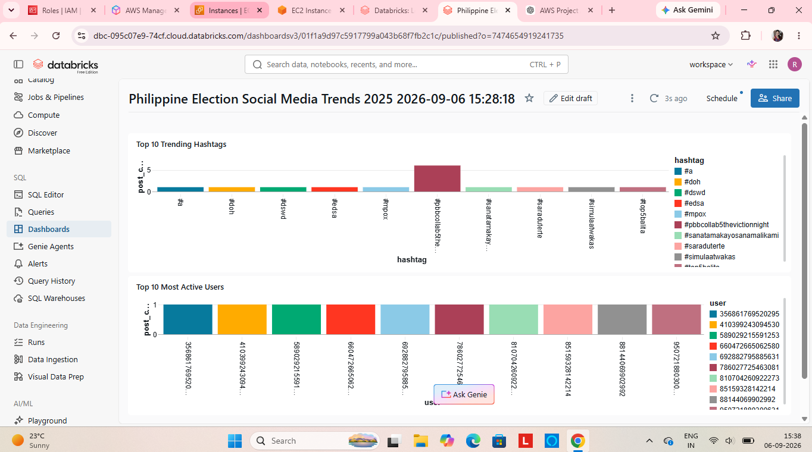

#  Philippine Election Social Media Trends 2025
A real-time data engineering pipeline that processes social media data using Apache Kafka, AWS, Databricks Structured Streaming, Delta Lake and Databricks Dashboards.
## 📌 Project Overview
This project demonstrates an end-to-end real-time data engineering pipeline for analyzing social media activity related to the Philippine Election 2025.
Social media posts are read from a dataset and streamed through Apache Kafka. Databricks Structured Streaming processes the incoming data, extracts useful information, stores the processed data in Delta tables and generates analytics for trending hashtags and the most active users.
The final insights are presented through an interactive Databricks Dashboard.
## 🏗️ Architecture

## Project flow:-
Dataset
   ↓
Amazon S3
   ↓
Python Producer
   ↓
Apache Kafka
   ↓
Databricks Structured Streaming
   ↓
Delta Lake
   ↓
Analytics
   ↓
Databricks Dashboard
## 🔄 End-to-End Data Flow
1. Social media data is stored in Amazon S3.
2. A Python producer reads the dataset.
3. Each record is converted into a JSON message.
4. The producer sends messages to an Apache Kafka topic.
5. Databricks Structured Streaming consumes the Kafka messages.
6. Kafka messages are parsed and transformed into structured data.
7. Processed data is stored using Delta Lake.
8. Analytical aggregations calculate trending hashtags.
9. Analytical aggregations identify the most active users.
10. Results are displayed in a Databricks Dashboard.
## 🛠️ Technologies Used
| Technology | Purpose |
|---|---|
| AWS S3 | Source dataset storage |
| AWS EC2 | Kafka and producer environment |
| Python | Data producer and message generation |
| Docker | Kafka containerization |
| Apache Kafka | Real-time event streaming |
| Databricks | Data processing and analytics |
| Apache Spark Structured Streaming | Stream processing |
| Delta Lake | Processed data storage |
| Databricks SQL | Analytical queries |
| Databricks Dashboard | Data visualization |
| GitHub | Source code and project documentation |
## ☁️ AWS Infrastructure
### Amazon EC2
The EC2 instance was used as the streaming environment for:
- Apache Kafka
- Docker
- Python producer scripts
### Amazon S3
Amazon S3 was used to store the source dataset.
### IAM
IAM roles and permissions were configured to allow secure access between AWS services and Databricks.
### Networking
The Kafka broker was accessed through the EC2 public IPv4 address and configured using Kafka advertised listeners.
## 📨 Kafka Streaming
Kafka acts as the real-time messaging layer.
### Kafka Topic
```text
twitter
## Message flow:-
Python Producer
      ↓
Kafka Producer
      ↓
Kafka Topic: twitter
      ↓
Databricks Structured Streaming
## ⚡ Databricks Streaming Pipeline
Databricks Structured Streaming consumes messages from Apache Kafka.
The pipeline performs the following operations:
1. Connects to the Kafka broker.
2. Reads messages from the `twitter` topic.
3. Converts Kafka binary values into strings.
4. Parses JSON messages using a Spark schema.
5. Extracts relevant social media fields.
6. Stores streaming data in Delta format.
7. Creates analytical aggregations.
## 💾 Data Storage and Tables
The processed streaming data is organized into tables for analysis.
### Raw Streaming Data
Contains parsed social media records received from Kafka.
### Trending Hashtags
Contains hashtag frequency counts used to identify trending topics.
### Most Active Users
Contains user activity counts based on the number of posts.
These tables are used as the source for the Databricks Dashboard.
## 📊 Analytics
The project currently generates the following insights:
### 🔥 Top Trending Hashtags
Hashtags are extracted from social media posts, normalized, grouped, and counted.
### 👥 Most Active Users
Users are grouped based on their posting activity and ranked by post count.
## 📈 Dashboard
The Databricks Dashboard provides real-time insights into social media activity.
### Top Trending Hashtags

### Top 10 Most Active Users

### Full Dashboard

## 📁 Project Structure
```text
social-media-trends/
│
├── README.md
├── LICENSE
├── .gitignore
│
├── architecture/
│   └── architecture.png
│
├── data/
│   └── README.md
│
├── producer/
│   ├── producer.py
│   ├── hashtag_test.py
│   └── requirements.txt
│
├── kafka/
│   └── docker-compose.yml
│
├── databricks/
│   └── streaming_pipeline.py
│
└── screenshots/
    ├── dashboard.png
    ├── trending_hashtags.png
    └── active_users.png
## 🚀 How to Run the project:-
### 1.Clone the Repository
```bash
git clone YOUR_REPOSITORY_URL
### 2.Start Kafka
cd social-media-trends
cd kafka
docker compose up -d
### 3.Run the Python Producer
cd producer
source venv/bin/activate
python producer.py
### 4.Run the Databricks Pipeline
Run the Databricks notebook cells in sequence:
Define the Spark schema.
Connect to Kafka.
Parse streaming JSON messages.
Store the processed data.
Create analytical tables.
Create the dashboard visualizations.
## ⚙️ Important Configuration
Kafka is configured using the EC2 public IPv4 address.
If the EC2 instance is stopped and started without an Elastic IP, the public IPv4 address may change.
Update the Kafka advertised listener accordingly:
```text
KAFKA_ADVERTISED_LISTENERS=
INTERNAL://kafka:29092,
HOST://localhost:39092,
EXTERNAL://YOUR_EC2_PUBLIC_IP:9092
### After updating the configuration:
docker compose down
docker compose up -d
## 🧩 Challenges and Solutions
### Kafka External Connectivity
**Challenge:**  
The EC2 public IPv4 address changed after the instance was stopped and restarted.
**Solution:**  
The Kafka `KAFKA_ADVERTISED_LISTENERS` configuration was updated with the new EC2 public IPv4 address and the Kafka container was restarted.
### Kafka Message Parsing
**Challenge:**  
Kafka message values were received as binary data.
**Solution:**  
The Kafka value column was converted to a string before parsing the JSON payload.
### Streaming Checkpoint Configuration
**Challenge:**  
Databricks required an explicit checkpoint location for streaming operations.
**Solution:**  
A checkpoint location inside a Unity Catalog Volume was specified.
### Streaming Output Mode
**Challenge:**  
An unsupported streaming output mode was used for a non-aggregated streaming DataFrame.
**Solution:**  
The streaming operation was adjusted to use an appropriate output mode based on whether aggregation was performed.
### Public DBFS Restriction
**Challenge:**  
The workspace did not allow checkpoints in the public DBFS root.
**Solution:**  
Checkpoint locations were moved to a supported Unity Catalog Volume.
## 🚀 Future Improvements
- Integrate a live social media API.
- Add sentiment analysis.
- Perform topic classification.
- Track trends over time.
- Add engagement analytics.
- Implement data quality checks.
- Add automated deployment.
- Use CI/CD pipelines.
- Add monitoring and alerting.
- Use an Elastic IP or DNS for stable Kafka connectivity.
## 🔐 Security
No sensitive credentials are included in this repository.
The following files and information should never be committed:
- AWS access keys
- Secret keys
- Databricks tokens
- `.env` files
- SSH private keys
- `.pem` files
- Personal connection strings
## 📌 Project Status
The project successfully demonstrates:
- Real-time event streaming
- Kafka integration
- Spark Structured Streaming
- Cloud infrastructure
- Delta Lake storage
- Analytical transformations
- Interactive dashboards
## 👤 Author
Riya Raj Kumari
Data Engineering / Cloud / Real-Time Streaming Project
